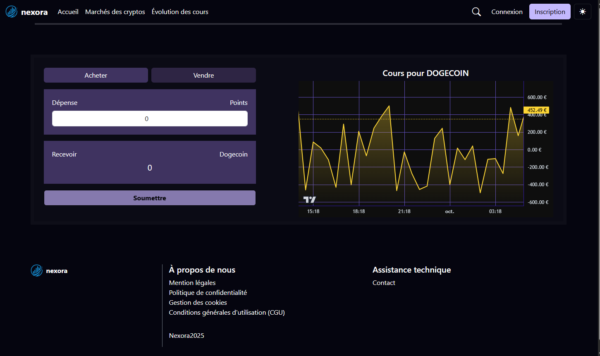
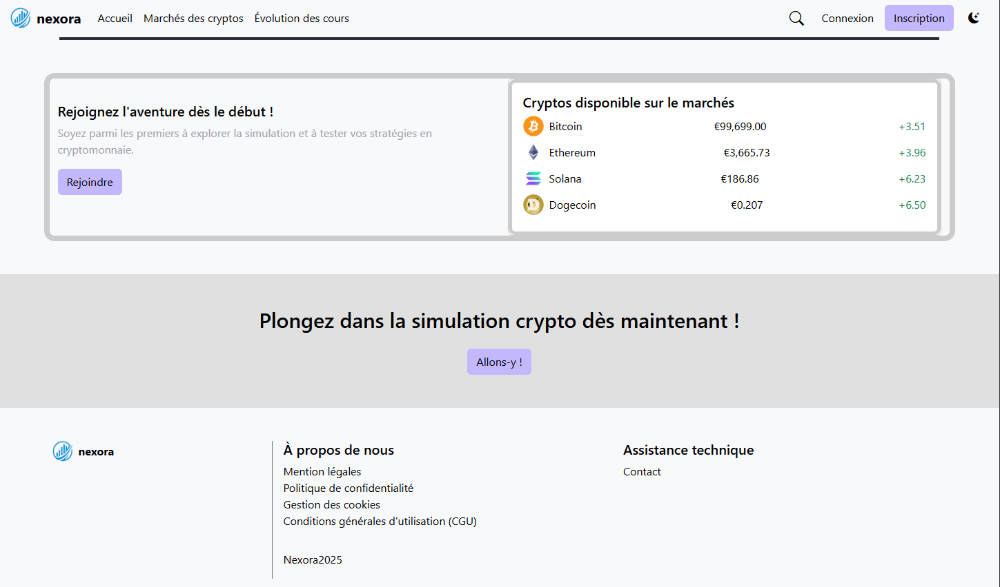
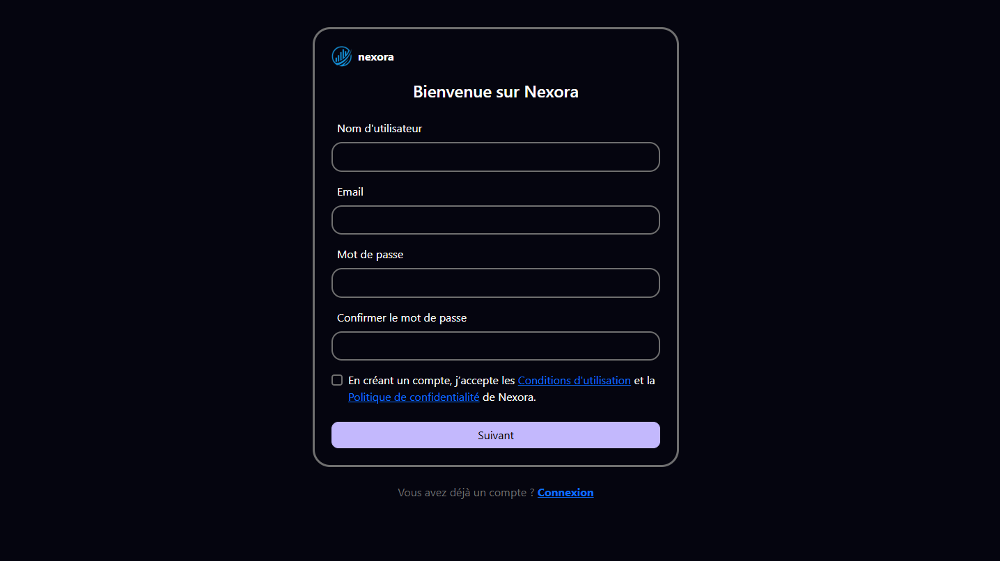
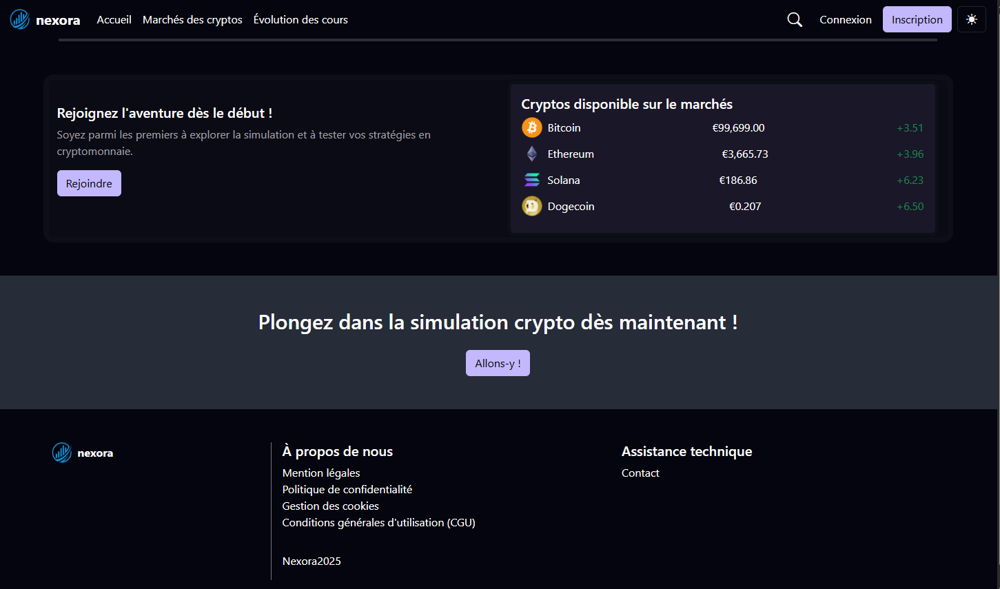
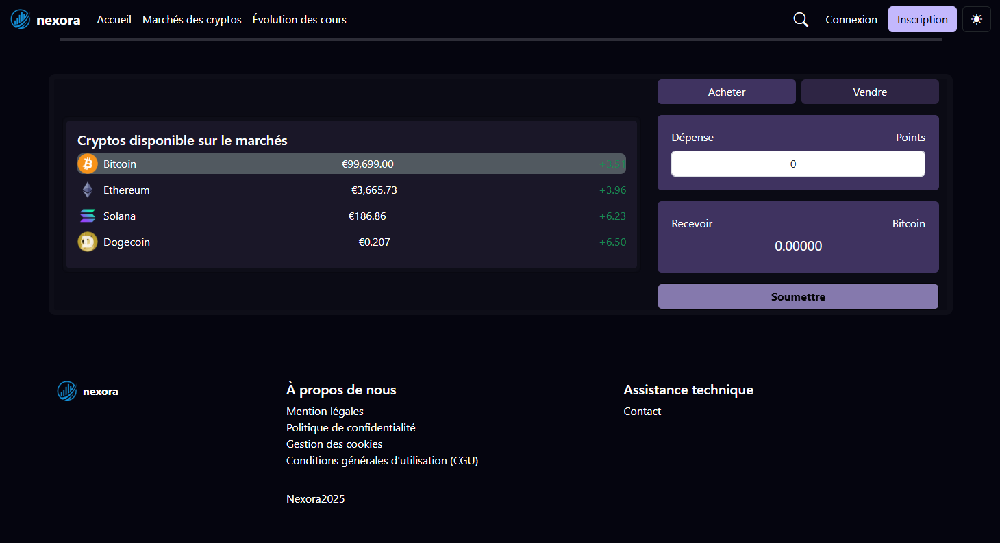
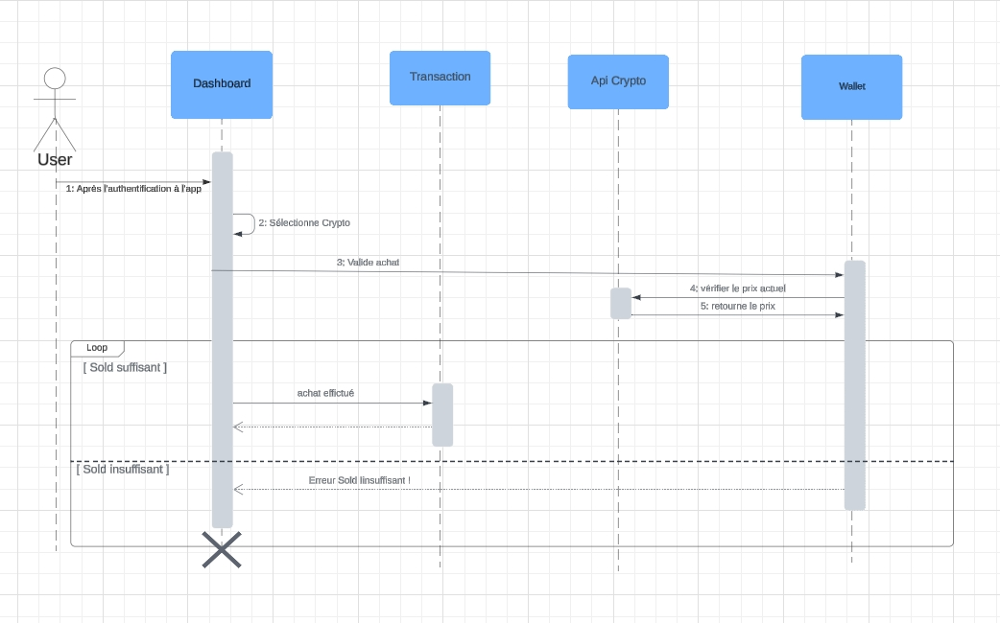
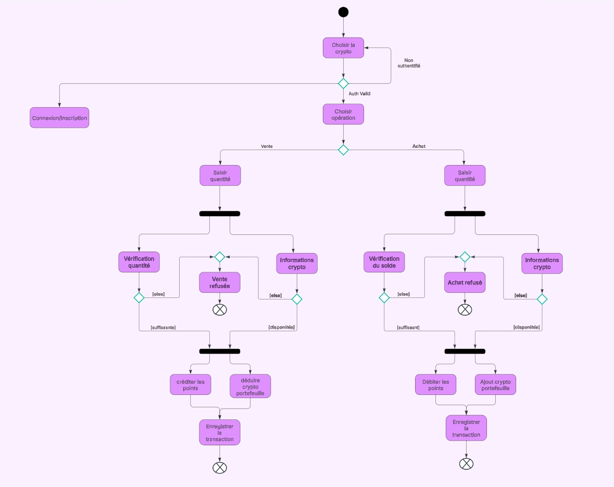
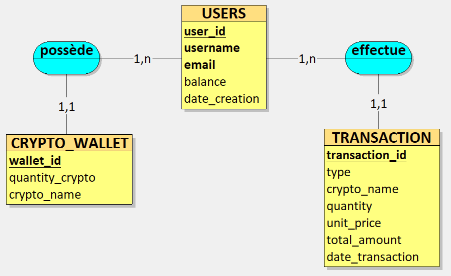

# Nexora Crypto

**Nexora Crypto** est une application web de simulation de trading de cryptomonnaies. Elle permet aux utilisateurs de gérer un portefeuille virtuel, acheter et vendre des cryptomonnaies en temps réel à partir de l'API CoinGecko.

---

## Aperçu de l'application

## 🔍 Aperçu de l'application

<p align="center">
  
  
  
  
  
  
</p>

---

## Fonctionnalités principales

- Inscription avec vérification par e-mail
- Connexion sécurisée via JWT
- Achat / vente de cryptomonnaies avec suivi de solde
- Portefeuille avec variation de prix en temps réel
- Historique des transactions
- Mode sombre & claire

---

## Lancement du projet en local

### Prérequis

- Docker & Docker Compose

### Étapes

1. Cloner le projet :
```bash
https://github.com/votre-utilisateur/nexora-crypto.git](https://github.com/koceila-Hk/nexora_crypto_app.git
cd nexora_crypto_app
```

2. Créer un fichier `.env` à la racine du projet avec le contenu suivant :

```env
MYSQL_ROOT_PASSWORD=root
MYSQL_DATABASE:database
MYSQL_USER:root
MYSQL_PASSWORD:root

MONGO_INITDB_ROOT_USERNAME:root
MONGO_INITDB_ROOT_PASSWORD:root

COINGECKO_API_URL=https://api.coingecko.com/api/v3/

SPRING_MAIL_USERNAME=okokok@email.com
SPRING_MAIL_PASSWORD:motdepasse
SPRING_JWT_SECRET:clejwtsecrete
SECURITY_JWT_EXPIRATION_TIME:800000
APPLICATION_SECURITY_JWT_REFRESH_TOKEN_EXPIRATION:604800000
```

3. Lancer les services :
```bash
docker-compose up -d
```

4. Accéder à l'application :
- Backend : http://localhost:8080
- Frontend : http://localhost:4200

---


- `backend/` : API REST Spring Boot
- `frontend/` : Application Angular
- `docker-compose.yml` : orchestration de la base MySQL, MongoDB et des conteneurs app

---

## Conception du système

### Diagramme de classes


### Diagramme de séquence



### Diagramme de cas d’utilisation


### Diagramme d’activité



### Diagramme d'entité-association (MCD)


---
## Conception de la base de données

### MCD



### Dictionnaire de données


---

##  Auteur

Koceila Habarek – Projet CDA – Concepteur Développeur d’Applications

---

## Contact

Pour toute remarque, suggestion ou amélioration, merci d’ouvrir une **issue** ou un **pull request**.

---

**© 2025 Nexora Crypto – Tous droits réservés**
